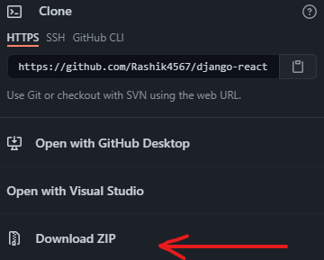

## This is a online store backbone with all the features(including payment methodes and seller varifications and more!) needed in it. 

Its based on **Python Django framework** with restful apis with **Django rest framework**. The frontend is made with **React, react/cli, create-react-app**. <br />
Please check the installation steps below to get started.

## PRE-INSTALLATIONS
**These are the dependencies you need to run this project.**
**If you encounter any errors or bugs at any stage of the project, please create an issue.**
<ul>
  <li>
    Python3 ( build on version 3.9.2 )
  <li>
    Node.js ( build on version 14.16.0 )
    </li>
    </ul>

## Installation
**If you made sure the pre-installations, you may advance to this step.**
<br />
**Step-1:** Clone the repo from Github. <br>
<ul>
<li>From Gitbub, download the repo zip and extract it. <br />

<br /></li>
  <li>
Or from github cli, <br />
  
```bash
$ git clone "https://github.com/Rashik4567/django-react-ecommerce.git"
```
</li>
</ul>

**Step-2:** Inside your local copy(clone) of the repo, open up a terminal(or cmd) and use command, <br />
```bash
$ python3 ./install.py
```
> :warning: **This step requires python and node installed.** In windows you dont need the python version tag. Then go with ```python ./install.py```


## Running
**After completing installation, you can run the server using `python3 .`(`python .` on windows).** <br /><br />
installation makes a must needed migration for the first time. After each time you change database models, you need to migrate manually by using `$ python3 manage.py makemigratios` and if it is successfully executed, `$ python3 manage.py migrate`. <br>
<br>
The database is SQLITE by default.

## Development and contribution
**When contributing, you don't need to worry about anything. If you think you will break while updating or developing, you are wrong.** <br> <br>

> For development, you first need to **FORK** the repository from the official repository. **( Please check below for help )** <br>
> Then simply run the server on localhost and make changes you want. <br>
> After making changes, you need to commit the changes and push it to github. After that, you can now open a pull request describing your changes. If we  think your changes are worth, we will accept the request and you will be one of the contributor/s.  ( **Please check below for help** )
<br> <br> <br>
> :warning: **Please beaware of code formation. Unmatched formation may create unnecessary conflicts**, we use **Pretter code formatter** for javascript and **autopep8** for python. <br>
<br>

For our database planning, you can check https://drawsql.app/ai-explorers/diagrams/r-shop-premium 


## Help and links
About forking a repository  : https://docs.github.com/en/github/getting-started-with-github/fork-a-repo <br> <br>
About commiting changes     : https://docs.github.com/en/github/getting-started-with-github/pushing-commits-to-a-remote-repository <br> <br>
About pushing to github     : https://github.com/git-guides/git-push <br> <br>
About pull request          : https://docs.github.com/en/github/collaborating-with-issues-and-pull-requests/creating-a-pull-request <br> <br>

**For more help, please create an issue.**

